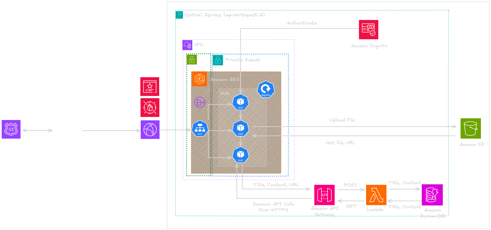
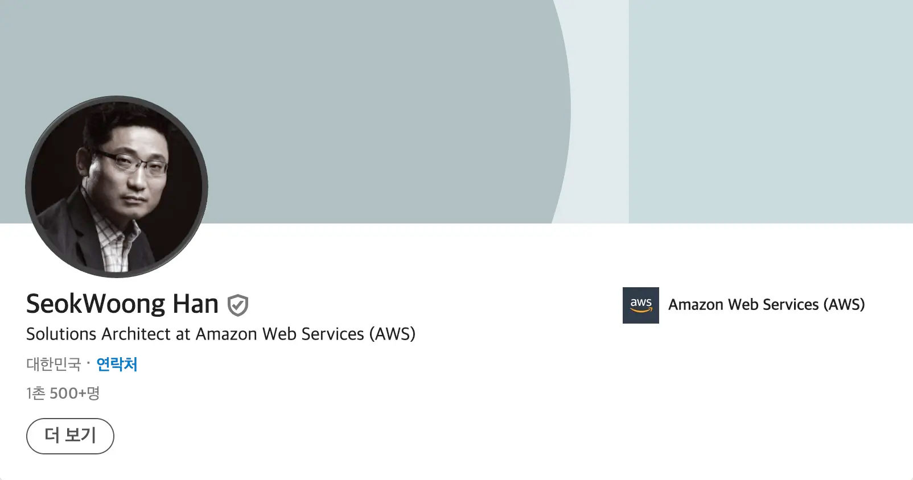
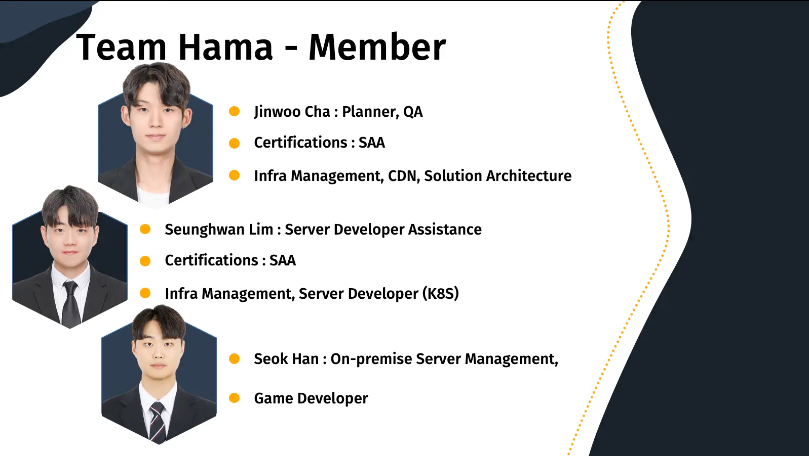

# A Hybrid Journey for Minecraft Server Scalability with AWS main page

> The main page of the final project written and organized in Terraform for [The Amazon Cloud School 5th](https://edu.rapa.or.kr/archive/652).
>
> The project was recognized with an [award of excellence](https://publish-01.obsidian.md/access/41ab6bbba02f01e448062db8b24d4470/Picture/Certifications-20241020134003007.webp?ts=1729418400000&sig=eea4bb95592a5cfa0aa8061137f3616b6d0d219250734aff920c02cd364a62a1) in a project evaluation organized by [RAPA](https://edu.rapa.or.kr/) and AWS.
> 
> For more detailed information, please refer to [this link](https://publish.obsidian.md/rynforce/AWS+Cloud+School/Project/Final+Project/0.+Final+Project+Main+Page).

## Architecture


## Addons

- ### AWS Load Balancer Controller

  The [AWS Load Balancer Controller](https://kubernetes-sigs.github.io/aws-load-balancer-controller/) manages Elastic Load Balancers in an Amazon EKS cluster. Configures ALB/NLB resources through Kubernetes, automating load balancing to simplify deployment.

- ### AWS for Fluent Bit

  Utilizes [Fluent Bit](https://docs.aws.amazon.com/AmazonCloudWatch/latest/monitoring/Container-Insights-setup-logs-FluentBit.html) with AWS plugins for efficient log management. Fluent Bit sends logs to CloudWatch Logs or Kinesis Data Firehose, offering lower resource usage than Fluentd.

- ### Metrics Server

  [Metrics Server](https://github.com/kubernetes-sigs/metrics-server) is essential for autoscaling, gathering real-time metrics for Kubernetes and enabling the Horizontal Pod Autoscaler (HPA) to respond to resource demands.

- ### Karpenter

  [Karpenter](https://karpenter.sh/) dynamically provisions new nodes based on workload demands, observing real-time events to optimize cluster resources.

- ### Kube Prometheus Stack

  [Kube Prometheus Stack](https://github.com/prometheus-community/helm-charts/tree/main/charts/kube-prometheus-stack) combines Prometheus, Grafana, and Prometheus Operator to monitor Kubernetes environments effectively, offering end-to-end visibility of application metrics.

- ### Kube-ops-view

  [Kube-ops-view](https://codeberg.org/hjacobs/kube-ops-view) provides a visual interface for viewing the status of nodes, pods, and clusters, aiding in the real-time management and monitoring of Kubernetes clusters.

- ### ArgoCD

  [ArgoCD](https://argo-cd.readthedocs.io/) is a GitOps continuous delivery tool for Kubernetes, allowing for declarative configuration management and automated deployment of applications based on changes in Git repositories.

- ### EBS CSI Driver

  The [EBS CSI Driver](https://github.com/kubernetes-sigs/aws-ebs-csi-driver) enables dynamic provisioning of Amazon EBS volumes in Kubernetes. It simplifies storage management, allowing applications to automatically attach, mount, and detach EBS volumes as needed.

- ### Amazon EKS Blueprints Teams Terraform Module

  The [EKS Blueprints Teams module](https://github.com/aws-ia/terraform-aws-eks-blueprints-teams) manages multi-tenancy within Amazon EKS clusters. It facilitates team-based operations through isolated namespaces and access controls.

## Prerequisites

Before you begin, ensure that the following tools are installed:

- **AWS CLI** - Command-line interface for AWS. [Installation Guide](https://docs.aws.amazon.com/cli/latest/userguide/getting-started-install.html)
- **Terraform** - Infrastructure as code tool by HashiCorp. [Installation Guide](https://developer.hashicorp.com/terraform/tutorials/aws-get-started/install-cli)
- **kubectl** - Command-line tool for Kubernetes clusters. [Installation Guide](https://kubernetes.io/docs/tasks/tools/)
- **eksctl** - Official CLI for Amazon EKS. [Installation Guide](https://eksctl.io/installation/). For Ubuntu, you can also use [this script](./eksctl_install.sh).
- **Helm** - Kubernetes package manager. [Installation Guide](https://helm.sh/docs/intro/install/)

## Steps

### 1. Create IAM User attached AdninistratorAccess

```
# Step 1: Create an IAM user named 'admin'
# This command creates a new IAM user named 'admin'.
$ aws iam create-user --user-name admin

# Step 2: Attach AdministratorAccess policy to the 'admin' user
# This grants full admin rights to the user, enabling access to all AWS resources.
$ aws iam attach-user-policy --user-name admin --policy-arn arn:aws:iam::aws:policy/AdministratorAccess

# Step 3: (Optional) Create an access key for programmatic access
# Generating an access key allows 'admin' to interact with AWS services programmatically. 
# Make sure to store the access key and secret key securely.
$ aws iam create-access-key --user-name admin
# you can check AccessKeyId and SecretAccessKey
{
    "AccessKey": {
        "UserName": "admin",
        "AccessKeyId": "YOUR_ACCESS_KEY_ID",
        "Status": "Active",
        "SecretAccessKey": "YOUR_SECRET_ACCESS_KEY",
        "CreateDate": "2024-10-14T12:34:56Z"
    }
}
```

```
$ aws configure
AWS Access Key ID [None]: YOUR_ACCESS_KEY_ID
AWS Secret Access Key [None]: YOUR_SECRET_ACCESS_KEY
Default region name [None]: ap-northeast-2   # region you wanna launch resource in 
Default output format [None]: json           # json or yaml etc
```

```
$ export AWS_DEFAULT_PROFILE=<your_aws_profile_name>
```

Before you continue, you need to enable your AWS account to launch Spot
instances if you haven't launched any yet. To do so, create the
[service-linked role for Spot](https://docs.aws.amazon.com/AWSEC2/latest/UserGuide/spot-requests.html#service-linked-roles-spot-instance-requests)
by running the following command:

```
$ aws iam create-service-linked-role --aws-service-name spot.amazonaws.com || true
```

You might see the following error if the role has already been successfully
created. You don't need to worry about this error, you simply had to run the
above command to make sure you have the service-linked role to launch Spot
instances:

```
An error occurred (InvalidInput) when calling the CreateServiceLinkedRole operation: Service role name AWSServiceRoleForEC2Spot has been taken in this account, please try a different suffix.
```

### 2. Clone this repository to your local machine

```
$ git clone https://github.com/Team-Hama/A-Hybrid-Journey-for-Minecraft-Server-Scalability-with-AWS.git
```

Change directory to [infra](./infra) and update the
[variables.tf](./variables.tf), [terraform.tfvars](./terraform.tfvars) and [local.tf](./infra/local.tf)
accordingly. Check the plan and initiate apply to create the VPC, and the EKS
cluster, along with Karpenter to scale the node pool.

To create the cluster, run the following commands:

```
$ terraform init
$ terraform plan
$ terraform apply --auto-approve
```

Or, if you want to create the cluster module by module to have a better
understanding, remove `depends_on` from
[eks_cluster.tf](./infra/eks_cluster.tf) file and run the following commands:

```
$ terraform init
$ terraform plan

$ terraform apply -target="module.vpc" -auto-approve
$ terraform apply -target="module.eks" -auto-approve
$ terraform apply --auto-approve
```

Check the AWS console for the newly created VPC **[VPC ID from the Terraform
output]**

```
$ aws ec2 describe-vpcs --vpc-ids "vpc-0ae0071a560b7a269" --region=ap-northeast-2
{
    "Vpcs": [
        {
            "CidrBlock": "10.0.0.0/16",
            "DhcpOptionsId": "dopt-0b0d0955f7a6e6f89",
            "State": "available",
            "VpcId": "vpc-0ae0071a560b7a269",
            "OwnerId": "53xxxxxxxx44",
            "InstanceTenancy": "default",
            "CidrBlockAssociationSet": [
                {
                    "AssociationId": "vpc-cidr-assoc-0f08fa04c7809dbe6",
                    "CidrBlock": "10.0.0.0/16",
                    "CidrBlockState": {
                        "State": "associated"
                    }
                }
            ],
            "IsDefault": false,
            "Tags": [
                {
                    "Key": "blueprint",
                    "Value": "eks-cluster"
                },
                {
                    "Key": "Name",
                    "Value": "eks-cluster"
                }
            ]
        }
    ]
}    
```

Once completed (**after waiting about 15 minutes**), run the following command
to update the kube.config file to interact with the cluster through kubectl:

```
$ aws eks --region $AWS_REGION update-kubeconfig --name $CLUSTER_NAME
```

Then, check the EKS cluster, i.e.

```
$ eksctl get cluster --name=eks-cluster --region=ap-northeast-2
NAME            VERSION STATUS  CREATED                 VPC                     SUBNETS                                                                         SECURITYGROUPS  PROVIDER
eks-cluster     1.30    ACTIVE  2024-09-10T14:19:44Z    vpc-0ae0071a560b7a269   subnet-022e5f6ce1670fe14,subnet-02e1475b6290fcba6,subnet-0c62df535bc954c1f                      EKS
```

## Connect Network Between On-premise and AWS VPC using Transit Gateway and site to site VPN
> We asked our carrier to assign a public IP to our computers on-premises.VyOS needs to be given a public IP by DHCP to implement Site to Site VPN.

* Enter the Public IP of your VyOS into a variable in Terraform.tfvar and TGW and Customer GW will configure themselves.
* However, Terraform can't implement Site to Site VPN, so we have to do this by hand
* Try implementing it in the console via the link below

[Site to Site VPN](https://publish.obsidian.md/rynforce/AWS+Cloud+School/Project/Final+Project/Document/Site+to+Site+VPN)

## EKS Replica Expansion by CloudWatch Agent in On-premise
Unfortunately, we were unable to implement the Cloudwatch part with Terraform.

Please see below for instructions on how to set it up with the console

[How to trigger Lambda function](https://publish.obsidian.md/rynforce/AWS+Cloud+School/Project/Final+Project/Document/How+to+trigger+Lambda+function+by+CW+Alarm)

## Jenkins
"Jenkins is an open-source automation server that facilitates the automation of software development processes, such as building, testing, and deploying applications. As a widely adopted tool for Continuous Integration and Continuous Delivery (CI/CD), Jenkins enables teams to efficiently manage and accelerate their development pipelines by automating repetitive tasks. With its extensive plugin ecosystem, Jenkins can integrate with numerous tools, making it highly adaptable to different workflows and environments.

For more information about Jenkins and a deeper understanding of CI/CD, please refer to [this link](https://publish.obsidian.md/rynforce/AWS+Solution+Architect/Contents/Other+AWS+services+at+ASP)."

### Web application



For a repo of the image files built with Jenkins, please see the following [link](https://github.com/Team-Hama/Final_project_hama_web)

### Game application

For a repo of the image files built with Jenkins, please see the following link

## Autoscaling

### Karpenter

You need to make sure you can interact with the cluster and the `Karpenter`
pods are running, i.e.:

```
$ kubectl get pods -n karpenter
NAME                        READY   STATUS    RESTARTS   AGE
karpenter-c5447bdf5-7kp6j   1/1     Running   0          19m
karpenter-c5447bdf5-qc7lf   1/1     Running   0          19m
```

List the nodes available after creating the cluster.

```
$ kubectl get nodes          
NAME                                        STATUS   ROLES    AGE   VERSION
ip-10-0-101-90.us-east-2.compute.internal   Ready    <none>   35m   v1.30.2-eks-1552ad0 
```

Now, move to [EKS](./EKS) directory and deploy `Nginx` with
[nginx-deployment.yml](./EKS/nginx-deployment.yml) file.

```
$ kubectl apply -f nginx-deployment.yml 
deployment.apps/nginx-deployment created
$ kubectl get pods                      
NAME                               READY   STATUS    RESTARTS   AGE
nginx-deployment-576c6b7b6-6blkw   1/1     Running   0          22s
nginx-deployment-576c6b7b6-7nnd7   1/1     Running   0          22s
nginx-deployment-576c6b7b6-b4f8p   1/1     Running   0          22s
```

There are `3` pods running, as mentioned in the `YAML` file.
for scale out to 30 pods, input comment below

```
kubectl scale deployment/nginx-depolyment --replicas=30
```

We still have `1` worker node, as it is sufficient to accommodate all the `30` pods.

```
$ kubectl get nodes                     
NAME                                        STATUS   ROLES    AGE   VERSION
ip-10-0-101-90.us-east-2.compute.internal   Ready    <none>   48m   v1.30.2-eks-1552ad0 
```

We want to see `Karpenter` in action, right? To achieve that, increase the
replica from `30` to `150` , and apply the change. Wait for a couple of minutes,
and check for the nodes again.

```
$ kubectl scale deployment/nginx-depolyment --replicas=30
$ kubectl get nodes 
NAME                                        STATUS   ROLES    AGE   VERSION
ip-10-0-101-90.us-east-2.compute.internal   Ready    <none>   51m   v1.30.2-eks-1552ad0
ip-10-0-55-209.us-east-2.compute.internal   Ready    <none>   24s   v1.30.2-eks-1552ad0
```

YES!! Now we have `2` worker nodes, and `150` pods deployed. `Karpenter` scaled
out based on the settings and needs of the resources to accommodate the
desired pod counts.

Now, set the replica count to `3` again, and check for the results.

```
$ kubectl apply -f nginx-deployment.yml
deployment.apps/nginx-deployment configured
$ kubectl get pods --output name | wc -l
3
$ kubectl get nodes                                                             
NAME                                        STATUS   ROLES    AGE   VERSION
ip-10-0-101-90.us-east-2.compute.internal   Ready    <none>   60m   v1.30.2-eks-1552ad0
```

Also, you can check the `Karpenter` logs to have a better understanding.

```
$kubectl logs -f -n karpenter -l app.kubernetes.io/name=karpenter -c controller
 {"level":"INFO","time":"2024-09-10T14:45:22.231Z","logger":"controller","message":"discovered ssm parameter","commit":"62a726c","controller":"nodeclass.status","controllerGroup":"karpenter.k8s.aws","controllerKind":"EC2NodeClass
","EC2NodeClass":{"name":"default"},"namespace":"","name":"default","reconcileID":"bd9523a7-6456-4de3-9b32-3f9293425866","parameter":"/aws/service/eks/optimized-ami/1.30/amazon-linux-2-gpu/recommended/image_id","value":"ami-033b66e831e2c5f86"}
{"level":"ERROR","time":"2024-09-10T14:45:23.152Z","logger":"controller","message":"failed listing instance types for default","commit":"62a726c","controller":"disruption","namespace":"","name":"","reconcileID":"4bfd4c2f-61f3-4cc9-829d-930350fd859d","error":"no subnets found"}
{"level":"INFO","time":"2024-09-10T15:21:13.076Z","logger":"controller","message":"found provisionable pod(s)","commit":"62a726c","controller":"provisioner","namespace":"","name":"","reconcileID":"2033d0c2-e63a-4176-8b47-99d331d
df61f","Pods":"default/nginx-deployment-576c6b7b6-c4c2d, default/nginx-deployment-576c6b7b6-xhl9m, default/nginx-deployment-576c6b7b6-trkf4, default/nginx-deployment-576c6b7b6-gnb75, default/nginx-deployment-576c6b7b6-j2qwx and 47 other(s)","duration":"229.528995ms"}
{"level":"INFO","time":"2024-09-10T15:21:13.076Z","logger":"controller","message":"computed new nodeclaim(s) to fit pod(s)","commit":"62a726c","controller":"provisioner","namespace":"","name":"","reconcileID":"2033d0c2-e63a-4176-8b47-99d331ddf61f","nodeclaims":1,"pods":52}
{"level":"INFO","time":"2024-09-10T15:21:13.098Z","logger":"controller","message":"created nodeclaim","commit":"62a726c","controller":"provisioner","namespace":"","name":"","reconcileID":"2033d0c2-e63a-4176-8b47-99d331ddf61f","NodePool":{"name":"default"},"NodeClaim":{"name":"default-wgbwq"},"requests":{"cpu":"260m","memory":"290Mi","pods":"57"},"instance-types":"c4.xlarge, c5.xlarge, c5a.xlarge, c5ad.xlarge, c5d.xlarge and 17 other(s)"}
{"level":"INFO","time":"2024-09-10T15:21:15.752Z","logger":"controller","message":"launched nodeclaim","commit":"62a726c","controller":"nodeclaim.lifecycle","controllerGroup":"karpenter.sh","controllerKind":"NodeClaim","NodeClai
m":{"name":"default-wgbwq"},"namespace":"","name":"default-wgbwq","reconcileID":"509fbe1c-f406-471f-bf82-71b96f0a0245","provider-id":"aws:///us-east-2a/i-0f4fe866297af566d","instance-type":"t4g.xlarge","zone":"us-east-2a","capacity-type":"spot","allocatable":{"cpu":"3920m","ephemeral-storage":"17Gi","memory":"14103Mi","pods":"58"}}
{"level":"INFO","time":"2024-09-10T15:21:41.702Z","logger":"controller","message":"registered nodeclaim","commit":"62a726c","controller":"nodeclaim.lifecycle","controllerGroup":"karpenter.sh","controllerKind":"NodeClaim","NodeClaim":{"name":"default-wgbwq"},"namespace":"","name":"default-wgbwq","reconcileID":"31fab340-d7d4-4d84-9664-d6efe47eebf0","provider-id":"aws:///us-east-2a/i-0f4fe866297af566d","Node":{"name":"ip-10-0-55-209.us-east-2.compute.internal"}}
{"level":"INFO","time":"2024-09-10T15:21:54.762Z","logger":"controller","message":"initialized nodeclaim","commit":"62a726c","controller":"nodeclaim.lifecycle","controllerGroup":"karpenter.sh","controllerKind":"NodeClaim","NodeClaim":{"name":"default-wgbwq"},"namespace":"","name":"default-wgbwq","reconcileID":"6914e0ef-f121-4163-b757-cc87c84f3218","provider-id":"aws:///us-east-2a/i-0f4fe866297af566d","Node":{"name":"ip-10-0-55-209.us-east-2.compute.internal"},"allocatable":{"cpu":"3920m","ephemeral-storage":"18233774458","hugepages-1Gi":"0","hugepages-2Mi":"0","hugepages-32Mi":"0","hugepages-64Ki":"0","memory":"15136204Ki","pods":"58"}}
{"level":"INFO","time":"2024-09-10T15:28:12.725Z","logger":"controller","message":"disrupting nodeclaim(s) via delete, terminating 1 nodes (3 pods) ip-10-0-55-209.us-east-2.compute.internal/t4g.xlarge/spot","commit":"62a726c","controller":"disruption","namespace":"","name":"","reconcileID":"f167a15a-0515-479f-b9e1-5ecb273c3697","command-id":"5c4c0606-c72a-4602-860f-feb31101a5c5","reason":"underutilized"}
{"level":"INFO","time":"2024-09-10T15:28:13.262Z","logger":"controller","message":"tainted node","commit":"62a726c","controller":"node.termination","controllerGroup":"","controllerKind":"Node","Node":{"name":"ip-10-0-55-209.us-east-2.compute.internal"},"namespace":"","name":"ip-10-0-55-209.us-east-2.compute.internal","reconcileID":"b36e33e1-3deb-44b8-9ac6-6eaa2c10267c","taint.Key":"karpenter.sh/disrupted","taint.Value":"","taint.Effect":"NoSchedule"}  
{"level":"INFO","time":"2024-09-10T15:29:12.708Z","logger":"controller","message":"deleted node","commit":"62a726c","controller":"node.termination","controllerGroup":"","controllerKind":"Node","Node":{"name":"ip-10-0-55-209.us-east-2.compute.internal"},"namespace":"","name":"ip-10-0-55-209.us-east-2.compute.internal","reconcileID":"ccd91aa6-4fed-48f5-97fd-d117d8a989cd"}
{"level":"INFO","time":"2024-09-10T15:29:12.953Z","logger":"controller","message":"deleted nodeclaim","commit":"62a726c","controller":"nodeclaim.termination","controllerGroup":"karpenter.sh","controllerKind":"NodeClaim","NodeClaim":{"name":"default-wgbwq"},"namespace":"","name":"default-wgbwq","reconcileID":"0dea1bc7-8bd6-4a51-98d4-c771c0909529","Node":{"name":"ip-10-0-55-209.us-east-2.compute.internal"},"provider-id":"aws:///us-east-2a/i-0f4fe866297af566d"}

```

If you're interested in learning more about Karpenter, check out the links below

[Karpenter Main page](https://publish.obsidian.md/rynforce/DevOps/Kubernetes/Karpenter+Main+page)

[Karpenter A to Z](https://github.com/Rynf0rce/karpenter-A-to-Z)

## Monitoring with Prometheus & Grafana

We will be using Prometheus and Grafana for setting up the monitoring. to do
so, we will
enable [`kube-prometheus-stack`](https://github.com/aws-ia/terraform-aws-eks-blueprints-addons/blob/main/docs/addons/kube-prometheus-stack.md)
in our managed addons in the [eks_cluster.tf](./infra/eks_cluster.tf) file,
something like

```
enable_kube_prometheus_stack = true
    kube_prometheus_stack = {
      name          = "monitoring"
      chart         = "kube-prometheus-stack"
      chart_version = "62.6.0"
      repository    = "https://prometheus-community.github.io/helm-charts"
      namespace     = "monitoring"

      timeout = 900
    }
```

with some custom configs, i.e. the custom namespace, chart version and so on.
Once the deployment is done, we can list everything from the namespace with

```
$ kubectl get all -n monitoring
```

You can see, Grafana is running as a NodePort service, we can expose it with
AWS ALB to the world. [grafana.yml](./infra/grafana.yml) contains the necessary
configurations to create the ingress. You can get the ALB URL by the command

```
$ kubectl get ing -n monitoring
```

Also, you'll need to retrieve the Grafana admin password for the first
time using the `kubectl` command, i.e.

```
$ kubectl get secret -n monitoring monitoring-grafana -o jsonpath="{.data.admin-password}" | base64 --decode ; echo 
```

After that, you can visit the web address provided by the ingress, use `admin`
as the username, and hotly retrieved password to access Grafana. There, you
will see some prebuilt dashboards. Also, you can create your own or get by
ID(s) from [Grafana Labs](https://grafana.com/grafana/dashboards/?search=kubernetes)

If you want to access the `Prometheus` also, use this
[prometheus.yml](./infra/prometheus.yml) file to create the Ingress, i.e.

```
$ kubectl apply -f prometheus.yml
$ kubectl get ing -n monitoring
NAME         CLASS   HOSTS   ADDRESS                                                                  PORTS   AGE
grafana      alb     *       k8s-monitori-grafana-0d481f4284-1538150578.us-east-2.elb.amazonaws.com   80      64m
prometheus   alb     *       k8s-monitori-promethe-f7484f4f25-423861633.us-east-2.elb.amazonaws.com   80      25m
```

## Create IAM users for granting access to EKS

If you want to create IAM users and assign them administrator access or some
development access, go to the [iam.tf](./infra/iam.tf) file, uncomment it,
adjust the team users/settings according to your needs, and then apply the
changes with terraform.

## Cleanup

If you are using the `kube-prometheus-stack`, CRDs created by this chart are
not removed by default and should be manually cleaned up:

```
start=$(date +%s)
kubectl delete -f ../EKS/echoserver_full.yml
kubectl delete -f ../EKS/env-echoserver.yml
kubectl patch ingress argocd-ingress -n argocd -p '{"metadata":{"finalizers":[]}}' --type=merge
kubectl patch ingress grafana -n monitoring -p '{"metadata":{"finalizers":[]}}' --type=merge
kubectl patch ingress kube-ops-ingress -n monitoring -p '{"metadata":{"finalizers":[]}}' --type=merge
kubectl patch ingress prometheus -n monitoring -p '{"metadata":{"finalizers":[]}}' --type=merge
kubectl delete nodes --all
kubectl delete crd alertmanagerconfigs.monitoring.coreos.com
kubectl delete crd alertmanagers.monitoring.coreos.com
kubectl delete crd podmonitors.monitoring.coreos.com
kubectl delete crd probes.monitoring.coreos.com
kubectl delete crd prometheusagents.monitoring.coreos.com
kubectl delete crd prometheuses.monitoring.coreos.com
kubectl delete crd prometheusrules.monitoring.coreos.com
kubectl delete crd scrapeconfigs.monitoring.coreos.com
kubectl delete crd servicemonitors.monitoring.coreos.com
kubectl delete crd thanosrulers.monitoring.coreos.com
kubectl delete --all nodeclaim
kubectl delete --all nodepool
kubectl delete --all ec2nodeclass

cluster_arn=$(kubectl config get-clusters | grep "arn:aws:eks:")
kubectl config  delete-cluster "${cluster_arn}"
terraform destroy --auto-approve
end=$(date +%s)
echo Execution time was "$((end - start))" seconds.
```
**Always delete the AWS resources to save money after you are done.**

```
$ kubectl delete --all nodeclaim
$ kubectl delete --all nodepool
$ kubectl delete --all ec2nodeclass
$ kubectl config  delete-cluster arn:aws:eks:<region>:<account_id>:cluster/<cluster_name>
$ terraform destroy --auto-approve
```

Alternately, you can use [tf_cleanup.sh](infra/tf_cleanup.sh) to clean up
the resources.


## References
* [VyOS로 AWS Site to Site VPN 구축 및 테스트](https://slashpage.com/mchlkim/y9e1xp2x4y76427k35vz?lang=ko)
* [terraform-aws-eks-blueprints](https://aws-ia.github.io/terraform-aws-eks-blueprints/getting-started/)
* [Karpenter getting started](https://karpenter.sh/docs/getting-started/getting-started-with-karpenter/)
* [karpenter-blueprints](https://github.com/aws-samples/karpenter-blueprints/tree/main)
* [terraform-aws-eks-blueprints-addons](https://github.com/aws-ia/terraform-aws-eks-blueprints-addons/blob/main/docs/addons/aws-load-balancer-controller.md)
* [aws-load-balancer-controller](https://github.com/kubernetes-sigs/aws-load-balancer-controller/blob/main/helm/aws-load-balancer-controller/values.yaml)
* [terraform-aws-eks-blueprints-addon readme](https://github.com/aws-ia/terraform-aws-eks-blueprints-addon#readme)
* https://github.com/aws-ia/terraform-aws-eks-blueprints-addons/blob/main/main.tf
* [K8S HPA](https://medium.com/@amirhosseineidy/how-to-make-a-kubernetes-autoscaling-hpa-with-example-f2849c7bbd0b)
* [horizontal-pod-autoscale-walkthrough](https://kubernetes.io/docs/tasks/run-application/horizontal-pod-autoscale-walkthrough/)
* [terraform-aws-eks-blueprints-teams](https://github.com/aws-ia/terraform-aws-eks-blueprints-teams)
* [multiple-ingress](https://www.eksworkshop.com/docs/fundamentals/exposing/ingress/multiple-ingress)
* [aws-eks-best-practices](https://aws.github.io/aws-eks-best-practices/)
* [hardeneks](https://github.com/aws-samples/hardeneks)
* https://github.com/helm/helm/issues/11513
* https://github.com/prometheus-community/helm-charts/issues/436
* https://github.com/aws-samples/eks-workshop-v2/blob/7038f7c46a204fb20c88f45d22bdb4456b4a0f63/manifests/.workshop/terraform/base.tf
* https://external-secrets.io/latest/provider/aws-parameter-store/
* https://external-secrets.io/v0.10.3/introduction/getting-started/
* https://github.com/stakater/Reloader
* https://github.com/aws-samples/eks-blueprints-add-ons/tree/main/add-ons
* https://github.com/aws-ia/terraform-aws-eks-blueprints/blob/main/patterns/

[Demo video](https://www.youtube.com/watch?v=U3gMNRRNA4M)


# Mentor : [SeokWoong Han](https://www.linkedin.com/in/seokwoong-han-175b8530?originalSubdomain=kr)


# Member



| <a href="https://github.com/rynf0rce"></a> | <a href="https://github.com/ksh0811"></a> | <a href="https://github.com/ojs201"></a> | <a href="https://github.com/rttitity"></a> | <a href="https://github.com/shlim0118"></a> | <a href="https://github.com/Hanseok-git"></a> |
| :---: | :---: | :---: | :---: | :---: | :---: |
| 정진우 (rynf0rce) | 강성훈 (ksh0811) | 오재석 (ojs201) | 차진우 (rttitity) | 임승환 (shlim0118) | 한 석 (Hanseok-git) |

# Thanks to
| <a href="https://github.com/pcmin929"></a> | <a href="https://github.com/songminjjuk"></a> | <a href="https://github.com/guswns8431"></a> |
| :---: | :---: | :---: |
| 박찬민 (전임강사) | 송민석 (교육생) | 손현준 (교육생) |

