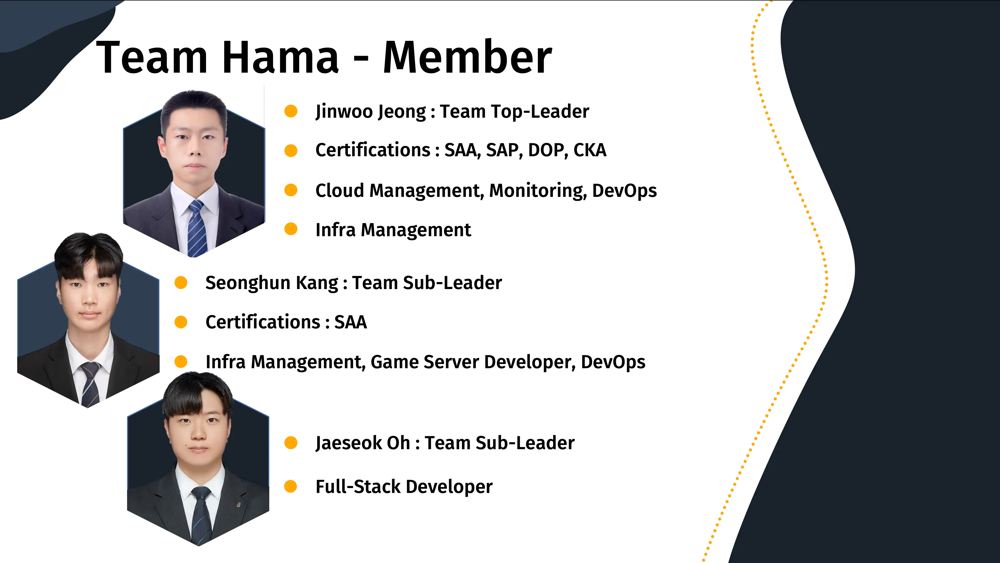

# Team Hama Main Page

# Mentor : [SeokWoong Han](https://www.linkedin.com/in/seokwoong-han-175b8530?originalSubdomain=kr)

# Member

|  |  |  |  |  |  |
| :---: | :---: | :---: | :---: | :---: | :---: |
| 정진우 (rynf0rce) | 강성훈 (ksh0811) | 오재석 (ojs201) | 차진우 (rttitity) | 임승환 (shlim0118) | 한 석 (Hanseok-git) |

# Architecture

# Thanks to
|  |
| :---: |
| 박찬민 (멘토) |

